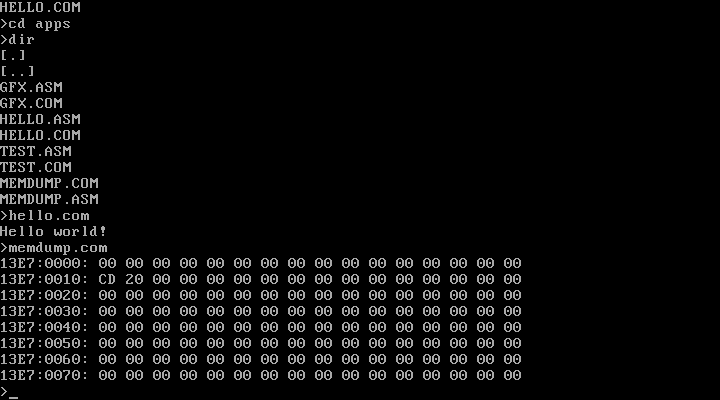

# MGCBEAN OS

MGCBEAN is a small hobby operating system. It consists of three builds:

- mgcbean.dos &mdash; 16-bit DOS-like OS, supports simple MS DOS commands like DIR, CD, VIEW and can run simple .com files.
- mgcbean.cli and mgcbean.gfx &mdash; 32-bit version with command-line and sort of graphics interface respectively.

.IMG files are FDD images with pre-installed MGCBEAN OS. Tested on Bochs and qemu.

The source code uses tabs, each tab is 8 spaces.

## MGCBEAN.DOS

This one is the most finished "operating system" of the three.
It looks a bit like DOS with a reduced set of commands:

- help
- cls
- cd
- date
- dir
- time
- ver
- view

It runs simple `.com` files, just make sure they don't depend on DOS libraries or interrupt calls.

The system itself is compiled as a `.com` file, meaning you can run it in an older version of Windows.

### How to run

```
qemu-system-i386 -fda mgcbean.dos.img -m 20
```

(or you can also start `!run.bat` in Windows).

### Screenshots





## MGCBEAN.CLI

A 32-bit version of the system; never finished.

### How to run

```
qemu-system-i386 -fda mgcbean.cli.img -m 20
```

## MGCBEAN.GFX

A 32-bit version of the system with graphic mode; bitmap fonts is the only thing that was implemented in it.

### How to run

```
qemu-system-i386 -fda mgcbean.gfx.img -m 20
```


Compile with [fasm](http://flatassembler.net/ "flat assembler").